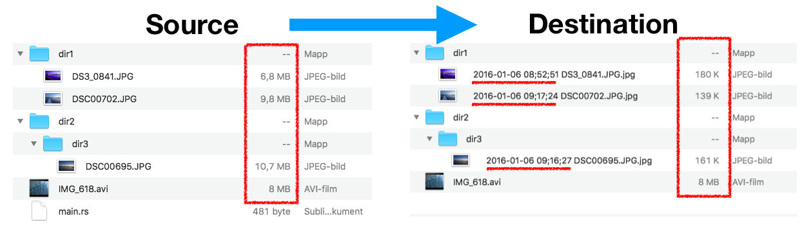

# ImageMapper

`ImageMapper` is a Rust command line tool for mapping/synchronizing a directory structure into a new structure with the following properties:

- Only images and videos are kept
- The exif date/time of images are prepended to their file name
- The images are downscaled and compressed
- Images/videos/directories are only transformed/copied on change

The image displays an example run

The purpose of having the date/time prepended is to be able to sort images by the time they were taken without needing special software that can read exif tags. For example, Windows Explorer and Finder can't sort by exif. But images transformed by `ImageMapper` become sorted by exif since the exif date/time is first in the file name. This is especially useful when images come from different cameras.

The purpose of compressing the images is so that it's faster to view and browse them over a LAN or the internet.

`ImageMapper` has a real world use case for me. Once a week, a Raspbery Pi runs `ImageMapper` to transform our collection of family photos to the new form. We then view the transformed images on the TV. Compared to viewing the original images, we now get them in the correct order and faster loading times. In addition, I also use `ImageMapper` in conjunction with my other project [HTTPImageServer](https://github.com/osklunds/HTTPImageServer) to view and browse all images directly in my smartphone.

## Running

**Note that files in the destination directory can be deleted, so be careful to specify the correct path.**

Example usage: `cargo run --release -- /my/src/path /my/dst/path TV -v`

This command will map the directory structure in `/my/src/path` to `/my/dst/path` with the `TV` quality, printing all actions.

For more information, type `cargo run -- --help`.

## Building, running, testing

Use `cargo build`, `cargo run` and `cargo test` as usual. When building the program for real use, include the `--release` flag. Then image conversions become significantly faster.

## Error handling

Currently when something goes wrong, `ImageMapper` will exit and print what happened. As I continue to use `ImageMapper` I plan to update the error handling to something appropriate.

## Compatibility

Platforms: Windows, Mac and Linux.

Images: jpg and png.

Videos: mov, avi, mp4, m4v and mpg.

## Credits

The images found in `test_resources` were taken by [Johann Siemens](https://unsplash.com/@johannsiemens?utm_source=unsplash&utm_medium=referral&utm_content=creditCopyText) and downloaded from [Unsplash](https://unsplash.com/search/photos/tree?utm_source=unsplash&utm_medium=referral&utm_content=creditCopyText).
